# FHIR R4 Platform — Technical Reference

> Version 1.1.1 · August 2026

---

## Table of Contents

1. [Introduction](#1-introduction)
2. [Technology Stack](#2-technology-stack)
3. [System Architecture](#3-system-architecture)
4. [Data Architecture](#4-data-architecture)
5. [Security Architecture](#5-security-architecture)
6. [API Reference](#6-api-reference)
7. [CI/CD Pipeline](#7-cicd-pipeline)
8. [Deployment Architecture](#8-deployment-architecture)
9. [Infrastructure](#9-infrastructure)
10. [Claims Processing Demo](#10-claims-processing-demo)
11. [Known Limitations & Roadmap](#11-known-limitations--roadmap)

---

## 1. Introduction

This document is the authoritative technical reference for the FHIR R4 Platform — a full-stack healthcare data platform implementing the HL7 FHIR R4 standard. It was built as an experimental project to demonstrate how a standards-compliant FHIR server can be constructed from modern, open-source components and deployed to a production cloud environment with automated CI/CD.

### Purpose

- Serve as a learning platform for FHIR R4 concepts and interoperability
- Provide a go-to-market demonstration of clinical billing workflows
- Establish a production-ready baseline for future healthcare integration work

### Scope

The platform consists of four deployable components:

| Component | Role |
|---|---|
| `fhir-server` | Java backend — FHIR R4 REST API + business logic |
| `fhir-admin-ui` | React admin interface — resource management, user admin, API console |
| `fhir-demo-client` | React claims demo — guided 5-step billing workflow |
| MongoDB | Document database — persists all FHIR resources and user accounts |

---

## 2. Technology Stack

### 2.1 HL7 FHIR R4

**Fast Healthcare Interoperability Resources (FHIR)** is an international standard published by HL7 that defines how healthcare data is represented and exchanged. R4 (Release 4) is the current stable version and the basis of US regulatory mandates (21st Century Cures Act).

Key concepts:
- **Resources** — discrete units of healthcare data (Patient, Encounter, Claim, etc.). Every resource has a `resourceType`, an `id`, and a structured JSON body.
- **REST API** — FHIR is inherently RESTful: `GET /fhir/Patient/{id}`, `POST /fhir/Encounter`, etc.
- **Coding systems** — standardised vocabularies (SNOMED CT for diagnoses, CPT for procedures, ICD-10 for billing, LOINC for lab results) ensure data means the same thing across all vendors.
- **Interoperability** — any FHIR R4-compliant system (Epic, Cerner, Athena, Medicare) can exchange data with any other without custom mapping.

This platform supports **15 resource types**: Patient, Practitioner, Organization, Encounter, Condition, Observation, MedicationRequest, AllergyIntolerance, Immunization, Procedure, DiagnosticReport, CarePlan, Claim, Coverage, ExplanationOfBenefit.

### 2.2 HAPI FHIR

**HAPI FHIR** (https://hapifhir.io) is the leading open-source Java library for FHIR. It provides:
- Java model classes for every FHIR resource type
- A **Plain Server** framework — you write resource providers (one Java class per resource type) and HAPI handles routing, serialisation, and CapabilityStatement generation automatically
- A **JPA Server** variant (not used here) that manages its own relational database

This project uses the Plain Server because it allows direct integration with MongoDB rather than requiring HAPI's own database schema.

Version: **7.2.0**

### 2.3 Spring Boot

**Spring Boot** (https://spring.io/projects/spring-boot) is a Java framework that eliminates boilerplate configuration for enterprise applications. It provides:
- Embedded Tomcat web server (no separate server install needed)
- Auto-configuration for MongoDB, security, async execution, and more
- Dependency injection (IoC container)
- `@RestController` for custom API endpoints alongside the HAPI FHIR server

Version: **3.2.5** on **Java 17**

### 2.4 MongoDB

**MongoDB** (https://www.mongodb.com) is a document database that stores data as JSON-like BSON documents. It is the natural choice for FHIR because:
- FHIR resources are native JSON — no schema translation required
- Each resource type gets its own collection (e.g., `fhir_patient`, `fhir_encounter`)
- Flexible schema accommodates FHIR's optional fields and extensions without migration scripts
- Rich query support for the resource search parameters FHIR requires

Version: **7.0** · Authentication: `--auth` with a dedicated `fhirapp` application user.

### 2.5 React + Vite + Tailwind CSS

The two frontend applications share the same toolchain:

| Tool | Purpose |
|---|---|
| **React 18** | UI component library — declarative, component-based rendering |
| **Vite 6** | Build tool and dev server — extremely fast HMR and production builds |
| **TypeScript** | Static typing — catches errors at compile time, improves IDE support |
| **Tailwind CSS 4** | Utility-first CSS — styles applied directly in JSX, no separate CSS files |
| **TanStack Query** | Server state management — caching, background refresh, loading/error states |
| **Axios** | HTTP client — interceptors for automatic JWT injection and 401 handling |
| **Lucide React** | Icon library |

### 2.6 Docker & Docker Compose

**Docker** packages each component into a self-contained image. **Docker Compose** orchestrates multiple containers as a named stack.

The project has three compose files:

| File | Environment | Notable overrides |
|---|---|---|
| `docker-compose.yml` | Dev | Builds from source, ports 8080/5173/5175/27017 |
| `docker-compose.staging.yml` | Staging | Overlay — different ports (8081/5174/5176/27018), separate MongoDB volume, distinct JWT secret |
| `docker-compose.prod.yml` | Production | Pulls from GHCR, adds Caddy + backup sidecar, MongoDB `--auth`, resource limits |

The `!override` YAML tag is required on port and volume lists to prevent Compose from merging (rather than replacing) the base file's values.

### 2.7 Caddy

**Caddy** (https://caddyserver.com) is a modern web server written in Go with automatic HTTPS as a first-class feature. On a domain-based deployment, Caddy obtains and renews Let's Encrypt certificates with zero configuration. In this release it serves HTTP only (bare IP — no ACME cert possible).

Role in the stack: terminates HTTP/HTTPS → reverse proxies to `fhir-admin-ui:80`.

### 2.8 GHCR (GitHub Container Registry)

Production images are built by GitHub Actions and pushed to **ghcr.io/fordpw/fhir-platform/**. The production host pulls these pre-built images — it never needs the source code, Maven, or Node.js. This decouples build from deploy and keeps the server stateless with respect to source.

### 2.9 Synthea

**Synthea** (https://synthetichealth.github.io/synthea/) is an open-source synthetic patient generator from The MITRE Corporation. It produces clinically realistic FHIR R4 bundles — patients with conditions, medications, encounters, claims — without using any real patient data. The platform invokes Synthea as a subprocess (bundled in the Docker image) and imports the resulting bundles into MongoDB.

### 2.10 Vitest + React Testing Library

The frontend test suite uses:
- **Vitest** — Vite-native test runner, compatible with the Jest API
- **React Testing Library (RTL)** — renders components in jsdom and queries by accessible roles/labels (not implementation details)
- **@testing-library/user-event** — simulates realistic user interactions
- **jsdom 25** — browser environment simulation (pinned to Node-20-compatible version)

26 tests across 6 files run in ~1.7 seconds.

---

## 3. System Architecture

### 3.1 High-level overview

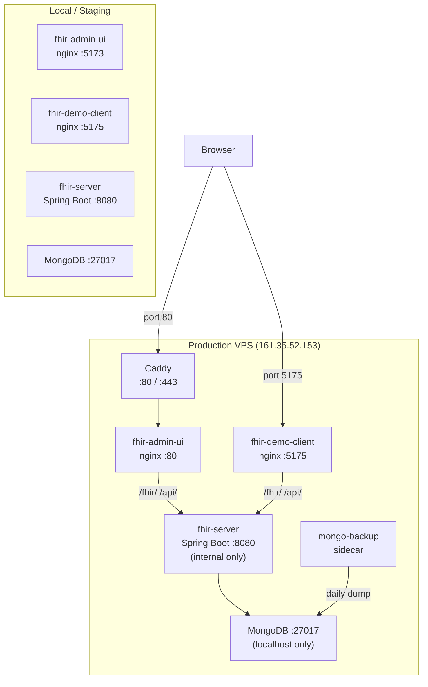

### 3.2 Request flow — Admin UI

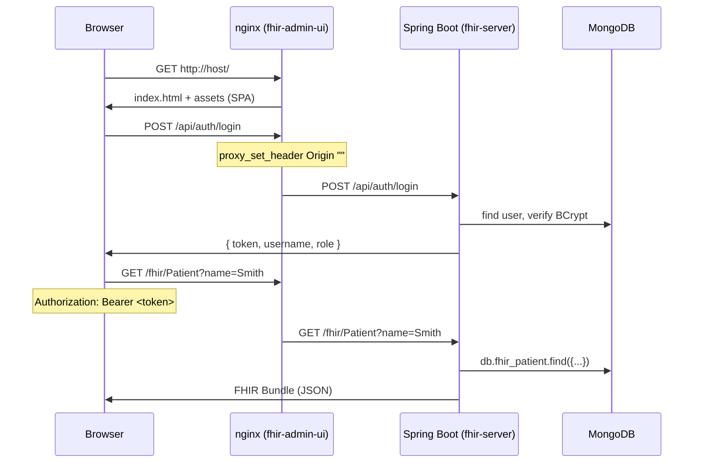

### 3.3 Request flow — Claims Demo

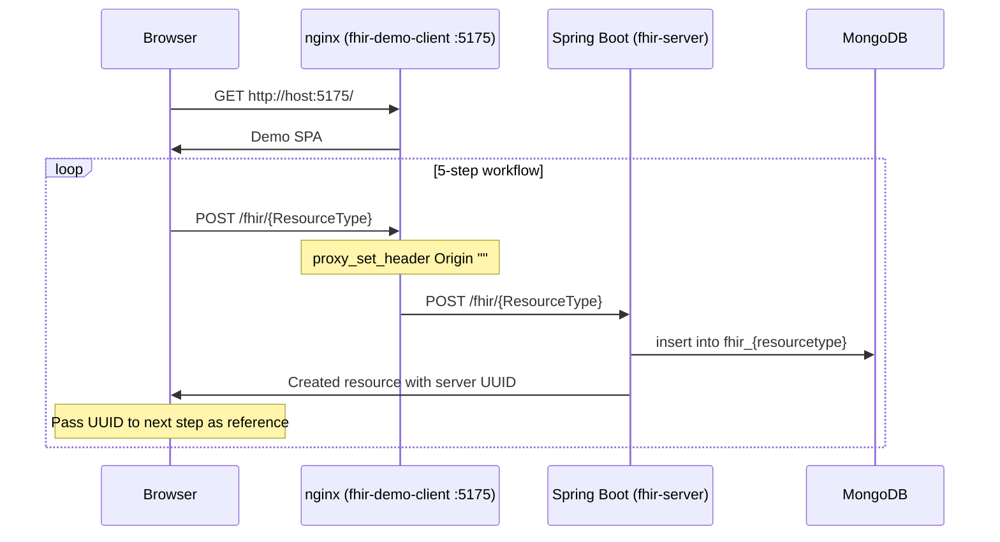

---

## 4. Data Architecture

### 4.1 MongoDB collections

| Collection | Contents | Key fields |
|---|---|---|
| `users` | Platform user accounts | `username` (unique), `password` (BCrypt), `role`, `enabled` |
| `fhir_patient` | Patient resources | FHIR JSON document + `_id` = FHIR resource id |
| `fhir_encounter` | Encounter resources | FHIR JSON + `subject.reference` |
| `fhir_condition` | Condition resources | FHIR JSON + `code.coding[].code` (SNOMED) |
| `fhir_claim` | Claim resources | FHIR JSON + `patient.reference`, `total.value` |
| `fhir_explanationofbenefit` | EOB resources | FHIR JSON + `payment.amount.value` |
| `fhir_*` | 10 more resource types | Same pattern |
| `synthea_jobs` | Async generation jobs | `status` (PENDING/RUNNING/COMPLETED/FAILED), `resourcesImported` |

The collection name is derived from the resource type: `FhirResourceDocument.collectionName("Patient")` → `"fhir_patient"`.

### 4.2 FHIR resource document model

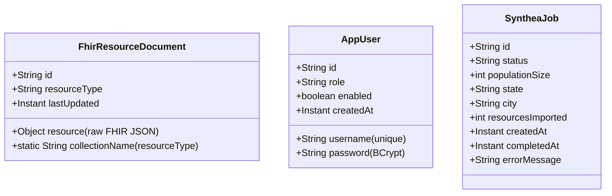

### 4.3 FHIR billing resource relationships

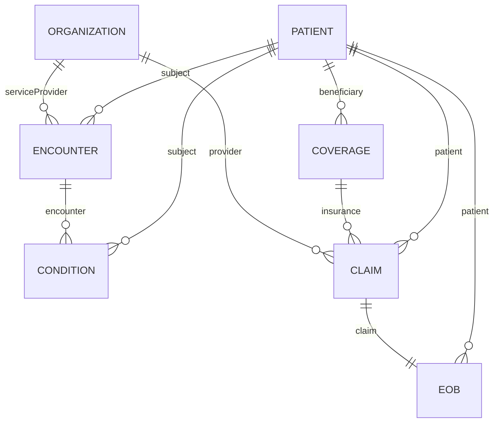

---

## 5. Security Architecture

### 5.1 Authentication flow

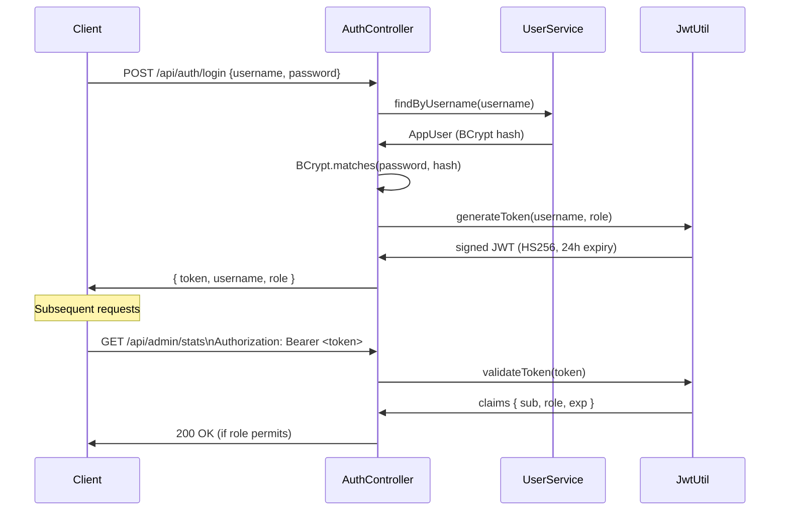

### 5.2 JWT structure

```
Header:  { "alg": "HS256", "typ": "JWT" }
Payload: { "sub": "admin", "role": "ADMIN", "iat": ..., "exp": ... }
Signature: HMAC-SHA256(base64(header) + "." + base64(payload), APP_JWT_SECRET)
```

The signing secret is environment-specific:
- Dev: `APP_JWT_SECRET` (from `.env`, gitignored)
- Staging: `STAGING_APP_JWT_SECRET` (separate variable — prevents bleed-over)
- Production: `APP_JWT_SECRET` in GitHub `production` environment secrets

**Cross-environment isolation is verified:** a token minted in dev returns HTTP 401 when presented to staging, and vice versa.

### 5.3 HTTP status codes

| Scenario | Code | Reason |
|---|---|---|
| Missing / expired / invalid token | 401 | `token_expired` / `invalid_token` / `unauthorized` |
| Valid token but insufficient role | 403 | Authenticated, not authorized |
| Bad credentials at login | 401 | `Invalid username or password` |
| Disabled account | 403 | `Account is disabled` |

The 401/403 split is critical: the frontend clears session and redirects to login on 401 only. A 403 means the user is signed in but lacks permission — signing out would not help.

### 5.4 Role-based access control

| Role | Capabilities |
|---|---|
| `ADMIN` | Full access — user management, Synthea, all FHIR CRUD, stats, API Console |
| `PRACTITIONER` | FHIR resource read/write, stats; no user management |
| `READONLY` | FHIR resource read, stats; no writes |

FHIR endpoints (`/fhir/**`) are `permitAll` — they are unauthenticated at the HTTP level. The admin UI requires login; raw API access does not. This is standard FHIR server behaviour.

### 5.5 Security decisions and their rationale

| Decision | Rationale |
|---|---|
| Hex passwords for MongoDB URI | Base64 can produce `/` which breaks URI parsing in MongoDB connection strings |
| `proxy_set_header Origin ""` in nginx | Strips browser Origin before forwarding — prevents FHIR server CORS rejection when demo/admin UI runs on a different port |
| Registration requires ADMIN | Prevents anonymous privilege escalation (confirmed exploit before fix) |
| BCrypt for passwords | Adaptive hash — increases cost factor as hardware improves |
| MongoDB bound to 127.0.0.1 | Database not accessible from the public internet even if firewall fails |

---

## 6. API Reference

### 6.1 Authentication

```
POST /api/auth/login
Body:     { "username": string, "password": string }
Response: { "token": string, "username": string, "role": string }
Auth:     none (public)
```

### 6.2 FHIR REST API

All endpoints follow the FHIR R4 REST specification. The `{ResourceType}` placeholder accepts any of the 15 supported types.

```
GET    /fhir/metadata                   CapabilityStatement (public)
GET    /fhir/{ResourceType}             Search (supports ?name=, ?_count=, ?_offset=)
GET    /fhir/{ResourceType}/{id}        Read
POST   /fhir/{ResourceType}            Create (server assigns UUID)
PUT    /fhir/{ResourceType}/{id}        Update (resource must exist)
DELETE /fhir/{ResourceType}/{id}        Delete
```

Search returns a FHIR `Bundle` with `total`, `entry[]`, and pagination offsets.

### 6.3 Admin API

All endpoints require `Authorization: Bearer <token>`.

```
GET    /api/admin/stats                 Resource counts for all 15 types + total
GET    /api/admin/users                 List all users (ADMIN only)
POST   /api/admin/users                 Create user (ADMIN only)
PUT    /api/admin/users/{id}            Update role / enabled (ADMIN only)
DELETE /api/admin/users/{id}            Delete user (ADMIN only)
POST   /api/admin/synthea/generate      Trigger Synthea generation (ADMIN only)
GET    /api/admin/synthea/jobs          List all generation jobs
GET    /api/admin/synthea/jobs/{id}     Get job status
```

### 6.4 Stats response shape

```json
{
  "totalResources": 21000,
  "resourceCounts": {
    "Patient": 1000,
    "Encounter": 5000,
    "Condition": 3000,
    "Observation": 8000,
    ...
  }
}
```

Note: the response is **nested** (`resourceCounts` is an object). Early versions of the frontend typed it as flat, causing the dashboard to render only 2 of 15 cards. The correct accessor is `stats.resourceCounts`.

---

## 7. CI/CD Pipeline

### 7.1 Workflow overview

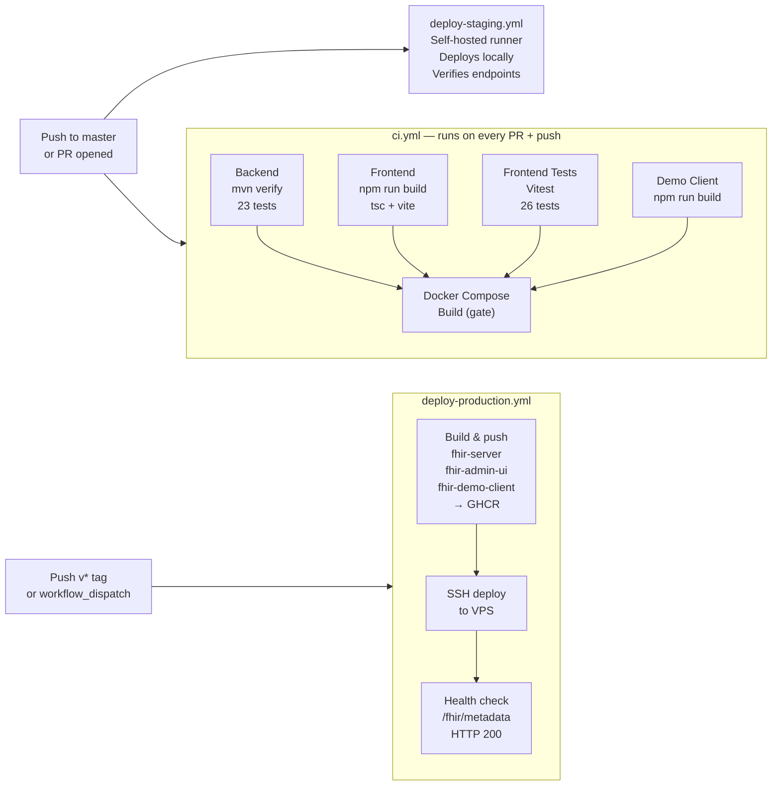

### 7.2 Job descriptions

| Workflow | Trigger | Jobs | Duration |
|---|---|---|---|
| `ci.yml` | PR + push to master | Backend (mvn verify), Frontend (build), Frontend Tests (26), Demo (build), Docker Compose build | ~2 min |
| `deploy-staging.yml` | Push to master | Self-hosted runner runs `deploy-staging.ps1`, verifies FHIR + login + frontend | ~1.5 min |
| `deploy-production.yml` | `v*` tag or `workflow_dispatch` | Build + push 3 images to GHCR, SSH to VPS, run `deploy-production.sh`, verify endpoints | ~5 min |

### 7.3 Self-hosted runner

The staging deploy requires a local GitHub Actions runner (`C:\actions-runner`) because staging runs on the same Windows machine as the developer. The runner must be started manually when needed:

```powershell
cmd /c C:\actions-runner\run.cmd
```

Without the runner running, the staging deploy job queues indefinitely — it does not fail, it just waits.

---

## 8. Deployment Architecture

### 8.1 Environments

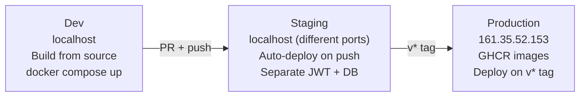

### 8.2 Port mapping

| Service | Dev | Staging | Production |
|---|---|---|---|
| Admin UI | 5173 | 5174 | 80 (via Caddy) |
| Demo Client | 5175 | 5176 | 5175 (direct) |
| FHIR Server | 8080 | 8081 | internal only |
| MongoDB | 27017 | 27018 | 127.0.0.1:27017 |

### 8.3 Docker Compose services (production)

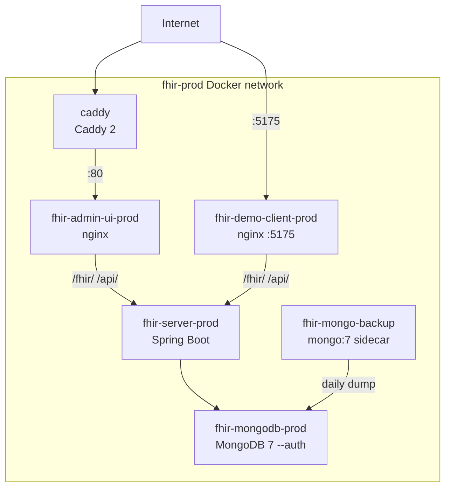

### 8.4 Installer modes

The cross-platform installers support four deployment modes:

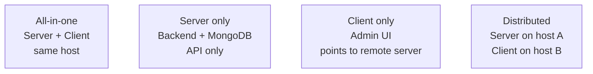

---

## 9. Infrastructure

### 9.1 Production VPS

| Attribute | Value |
|---|---|
| Provider | DigitalOcean |
| OS | Ubuntu 24.04 LTS |
| Size | 2 vCPU / 4 GB RAM / 80 GB SSD |
| Region | NYC1 |
| Monthly cost | ~$24 USD |
| IP | 161.35.52.153 |
| Deploy user | `deploy` (non-root, in `docker` group) |
| Repo location | `/opt/fhir-platform` |
| Backup location | `/var/backups/fhir-mongodb` |

### 9.2 Firewall rules (inbound TCP)

| Port | Service |
|---|---|
| 22 | SSH |
| 80 | HTTP (Caddy) |
| 443 | HTTPS (Caddy — ready when domain configured) |
| 5175 | Claims Demo (direct nginx) |

### 9.3 HTTPS upgrade path

Currently serving HTTP (bare IP — Let's Encrypt does not issue certificates for IP addresses). When a domain is available:

1. Point DNS A record to `161.35.52.153`
2. Update `DOMAIN` variable in GitHub → Settings → Environments → production
3. In `Caddyfile`, change `http://{$DOMAIN}` → `{$DOMAIN}`
4. Deploy — Caddy obtains the certificate automatically via ACME HTTP-01 challenge

No other changes required. Port 443 is already open in the firewall.

### 9.4 MongoDB backup

The `mongo-backup` sidecar runs a loop inside the same Docker network:

```bash
while true; do
  sleep 86400  # 24 hours
  mongodump --username root --authenticationDatabase admin \
            --db fhirdb --archive=/backups/fhirdb_$(date +%Y%m%d).gz --gzip
  find /backups -name '*.gz' -mtime +7 -delete
done
```

Backups accumulate at `/var/backups/fhir-mongodb` on the host. For off-host durability, add an `rclone` or `aws s3 cp` step after the dump.

---

## 10. Claims Processing Demo

### 10.1 Purpose

The demo (`fhir-demo-client`) is a go-to-market tool that makes the FHIR standard tangible for non-technical audiences. It walks through the complete revenue cycle for a single office visit — the sequence every US healthcare claim follows.

### 10.2 Workflow

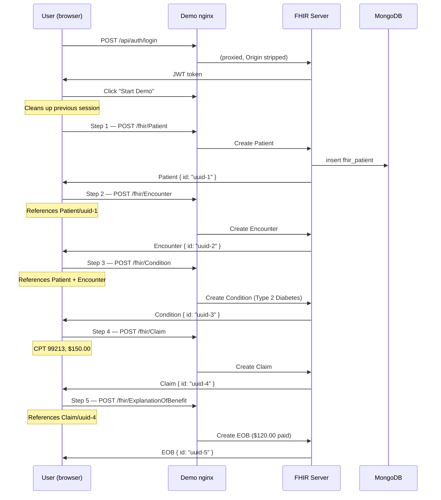

### 10.3 Key design decisions

| Decision | Rationale |
|---|---|
| POST (create) per step, not pre-loaded bundle | HAPI Plain Server has no transaction endpoint. PUT to a non-existent resource returns 404 (update-only, no upsert). |
| Server-assigned UUIDs | Ensures resources are genuinely created via the FHIR API, demonstrating the standard's create semantics |
| Deletes fire in background on reset | Awaiting sequential DELETEs triggered CORS preflights for each request, blocking the UI for several seconds |
| `proxy_set_header Origin ""` | The browser sends `Origin: http://host:5175` which the FHIR server rejects (only `http://host:5173` is allowed). Stripping it at the nginx layer bypasses CORS for this reverse-proxy pattern. |

---

## 11. Known Limitations & Roadmap

### 11.1 Current limitations

| Area | Limitation | Impact |
|---|---|---|
| TLS | Serving HTTP only — bare IP, no ACME cert | URLs are `http://`, data in transit is unencrypted |
| Frontend tests | Vitest unit tests only — no Playwright E2E | Auth redirect, pagination, and demo flow verified manually only |
| Database | MongoDB only | Customers with SQL infrastructure cannot use without Docker |
| HAPI Plain Server | No transaction bundle endpoint | Bulk import requires the Java `BundleImportService`, not HTTP POST |
| Synthea | Single-threaded subprocess | Large populations block the async executor until complete |
| Backup | Local host only | Disk failure loses all backups |

### 11.2 v1.2.0 Roadmap

| Feature | Description | Effort |
|---|---|---|
| HTTPS / TLS | Configure domain + remove `http://` prefix in Caddyfile | Low — Caddy handles the rest automatically |
| Playwright E2E tests | Browser-level tests for auth, pagination, demo workflow | Medium |
| PostgreSQL backend | `StorageAdapter` interface with `MongoStorageAdapter` (current) and `PostgresStorageAdapter` (JSONB) | High — significant refactor |
| Off-host backup | `rclone` or S3 transfer after `mongodump` | Low |
| Synthea async queue | Decouple generation from Spring async pool | Medium |

---

## Appendix A — Environment Variables

| Variable | Service | Purpose | Default |
|---|---|---|---|
| `APP_JWT_SECRET` | fhir-server | JWT signing secret | ⚠️ committed placeholder — override always |
| `STAGING_APP_JWT_SECRET` | fhir-server (staging) | Staging-specific JWT secret | ⚠️ committed placeholder |
| `SPRING_DATA_MONGODB_URI` | fhir-server | MongoDB connection string | `mongodb://localhost:27017/fhirdb` |
| `APP_CORS_ALLOWED_ORIGINS` | fhir-server | Permitted browser origins | `http://localhost:5173` |
| `APP_JWT_EXPIRATION` | fhir-server | Token lifetime (ms) | `86400000` (24h) |
| `SYNTHEA_JAR_PATH` | fhir-server | Path to Synthea JAR | `/opt/synthea/synthea-with-dependencies.jar` (Docker) |
| `MONGO_INITDB_ROOT_PASSWORD` | mongodb | Root password (first init only) | — (required in prod) |
| `MONGO_APP_PASSWORD` | mongodb | `fhirapp` user password | — (required in prod) |
| `IMAGE_TAG` | docker-compose.prod | GHCR image tag to pull | `latest` |
| `DOMAIN` | Caddyfile / deploy script | Hostname or IP | `161.35.52.153` |

---

## Appendix B — Test Coverage Summary

| Suite | File | Tests | What it covers |
|---|---|---|---|
| Backend | `JwtUtilTest` | 5 | Token generation, expiry detection, VALID/EXPIRED/INVALID classification |
| Backend | `SecurityStatusCodeTest` | 6 | 401 for missing token, 401 for expired token, 403 for wrong role |
| Backend | `AdminUserEndpointTest` | 6 | User creation, role validation, duplicate username rejection |
| Backend | `PagingTest` | 6 | `_offset` parameter, correct `Bundle.total`, distinct pages |
| Frontend | `client.test.ts` | 3 | 401 interceptor clears session + redirects; login 401 passthrough; 403 no-redirect |
| Frontend | `Login.test.tsx` | 3 | Session expiry notice from sessionStorage; bad-credentials error display |
| Frontend | `Dashboard.test.tsx` | 4 | All 15 resource-type cards render; total count; ADMIN button guard |
| Frontend | `Pagination.test.tsx` | 8 | Range text; last-page clamping; prev/next disabled; callback values |
| Frontend | `ApiConsole.test.tsx` | 4 | Toggle visible; starts checked; uncheck; re-check |
| Frontend | `UserManagement.test.tsx` | 4 | User list; create dialog opens; form submit; delete confirmation |
| **Total** | | **49** | |

---

*This document reflects the state of the platform at v1.1.1 (August 2026).*
*Maintainer: Paul W. Ford · Repository: https://github.com/fordpw/fhir-platform*
